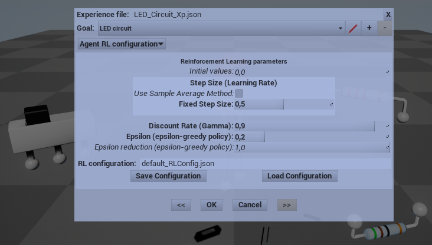

# Digital Scenario Framework Test for Unreal Engine

This project is a test case to show the use of a Virtual Environment (VE) as user interface for the [Digital Scenario Framework], a trial to study the cooperation between human and artificial intelligence (AI) applied to a generic digital scenario.

## Overview
This project includes some sample scenes. The main scene is based on the simplified electronic circuit test case.

### Simple Circuit Test
The Simple Circuit Test level is based on the “simple electronic circuit” test case defined in [Digital Scenario Framework]. This scene includes a 3D representation of electronic components and cables, the interaction support for components wiring, and a user interface.

 

*A screenshot from the Simple Circuit Test level.*

#### Interaction
A point-and-click interaction was implemented to connect electronic components and to activate switches. Cables are automatically created and added to the scene to show the connections among electronic components.

#### Feedback for actions
The user can directly interact with the scenario, adding, removing, moving circuit components and connect their leads with cables.

Visual hints are displayed about actions that can be taken and actions that lead to a failure or to a success, according to scenario-related conditions.

 

*Hints displayed while interacting.*

#### Representation of state changes
Entity state changes are visually represented: a LED can be lit on, an overheated battery shows hot air refraction, sparks are emitted when a short circuit occurs, and a little smoke trail appear when a resistor is burnt out. Often these visual representations seem somehow exaggerated, but their purpose is simply to clearly notify state changes and failure conditions (a typical failure condition is when at least one component is burnt out).

  

*Screenshots of components burning out.*

## Remarks
Please note that: 
* **this project is a just a test for the Digital Scenario Framework, not a circuit simulation;**
* **the circuit simulation is very simplified and does not reflect the real behavior;**
* this version works only for Windows 64 bit, anyway it can work with other platforms if the *DiScenFw* and *DiScenFwNET* binaries for other platforms are available.

## Features
Some editing functionalities are provided to create the scenario, including elements manipulation, collision detection, connections between elements, connection path editing, automatic regeneration of a connection element structure according to the given path.

### User interface
A user interface was developed to load and save the scenario configuration, to configure and control the experience goal and success or failure conditions, to configure and test the automatic training.
Scenario elements can be selected and dragged to change their positions. A catalog of components is available for the creation of new elements in the scenario.
The user interface allows to configure and run the automatic experience training, based on the RL agent defined in Digital Scenario Framework. During a training session a slider allow to set the interval between training steps and to enable or disable the scene synchronization with the scenario state, used to show scenario changes while they occur.

*RL configuration panel.*

### Experience control
The virtual environment can work in two modes: with or without updating the stored experience. If the experience updating is disabled the user can experiment with the interactive virtual environment to test the circuit simulation. With the experience updating enabled the user can train the system both manually (teaching by showing) and automatically.

### Automatic training
The latter mode allow to start an automatic training to improve the system experience, using the reinforcement learning agent provided by the framework. While the agent is performing actions, the results are visualized in real time in the virtual environment. The process continues until the user stops it, starting a new episode each time success or failure conditions are met. Optionally the user can choose to stop the process at the next successful episode.

## Implementation
This virtual environment was developed under Windows platform with [Unreal Engine 4] (UE4.16) and [Visual Studio] 2015 (VS2015), but should be compatible with newer versions (tested with UE4.27/VS2017), anyway tests and changes are planned to make it compatible with newer versions (see [Documentation](#documentation) for details). 

The proposed implementation consists of a function library for generic utility functions and a set of *actors* and *components* for the integration with the main Digital Scenario Framework library (*DiScenFw*).
The sample scenes included in the test project are Unreal maps with their related assets.

### Notation
The C++ source code mainly follows the coding standard suggested by the [UE4 documentation](https://docs.unrealengine.com/en-US/Programming/Development/CodingStandard/index.html). The UE4 project assets are named and organized according to [a standard style](https://github.com/Allar/ue4-style-guide).

### Blueprints
There are two ways to program in UE4: via C++ language (with the UE4 C++ API) or via visual programming (UE4 Blueprints Visual Scripting). The Blueprints Visual Scripting system, based on functional graphs, is an effective way to define the behavior of virtual world objects and to manage the interaction with the user. It is useful for VE rapid prototyping, but with some drawbacks. First of all many computations that could be done with few lines of C++ code often become intricate graphs in blueprints (“spaghetti effect”). Furthermore, common tools for source development and control cannot be applied to blueprints.

The solution adopted for Unreal Scenario Test is a trade off between rapid application development and code maintainability. Blueprints are used to connect virtual objects and user interface with native code (e.g. parameters initialization, simple behaviors, event response routing, higher-level interfaces), while C++ is used for defining custom blueprints, programming the application logic, interfacing with other software libraries and any other task that require particular attention and maintenance effort.

### Modules
The *UnrealScenarioTest* UE4 project is composed by some modules: *UnrealScenario* for the integration with the framework, *UnrealScenarioUI* for a standard user interface and *UnrealScenarioTest*, used to build the final test case.

#### Unreal Scenario module

##### Data conversion for data exchange with blueprints
UE4 is based on a set of common data definitions (`UnrealScenario.h`), used both in the C++ code and in blueprints. Furthermore C++ standard template library, widely used by *DiScenFw* library, cannot be used to exchange data with blueprints. For these reasons a mapping between *DiScenFw* data structures and UE4 types was defined in the *UnrealScenario* module.

##### DLL-UE4 integration: read-only access for parameters and return values
To improve modules decoupling, the Unreal Scenario module accesses the *DiScenFw* library as a dynamic linking library. In this case it must be granted that memory allocations e deallocations are done in the same module. Furthermore, UE4 uses a special memory management for data held by scene actors and components. To avoid critical errors, the *UnrealScenario* module accesses the *DiScenFw* data passing parameters or getting results by copy for primitive C++ types and as read-only references for STL (Standard Template Library) types and data structures based on them.

##### Entity state changes
Entity state changes, computed by the cyber system (see [Digital Scenario Framework] for details), are visually represented by visual effects, controlled by blueprints derived from a specific component (*EntityStateComponent*), specialized for each type of state change.

#### Unreal Scenario UI module
Another module (*UnrealScenarioUI*) was build to provide methods and a user interface to configure and control the digital scenario and the stored experience.
This module is based on UMG and a mix of C++ programming and Blueprints Visual Scripting.

#### Unreal Scenario Test module
A more specific module was also developed (*UnrealScenarioTest*), designed to build working tests and applications. This module include a more specific actor (*UnrealScenarioTestActor*) that provides support for the development of a generic testing application.

### Simple Circuit Test
A test application built with Unreal Scenario Test module is the Simple Circuit Test (*SimpleCircuitTestActor*), based on the “simple electronic circuit” test case defined in *Digital Scenario Framework*. This application includes a 3D representation of electronic components and cables, the interaction support for components wiring, and a user interface.

#### Interaction
The user interface defined in Unreal Scenario module is exploited in this application to configure and control the scenario, the experience and the learning process.

#### Feedback for actions
When electronic components are connected, instances of a blueprint are created and configured. Cables are not stored as scenario elements, they are in fact a visual representation of the connection relationship.
Cables are based on a UE4 component and dynamically adapt their length to keep components connected also when there are moved.

#### Representation of state changes
Entity state changes representation is delegated to the *Entity State Component* and its derived blueprints.

#### User interface
The user interface implementation is based on the Unreal Scenario UI module.

## Documentation

The reference documentation can be generated with [Doxygen].
The source code follow the Unreal Engine official [Coding Standard](https://docs.unrealengine.com/ProductionPipelines/DevelopmentSetup/CodingStandard/).

To build this project you first need to put *[Digital Scenario Framework]* repository files in a `DigitalScenarioFramework` folder under the root folder (the upper level folder of the UE4 project). You can change this location editing the paths in `Source/UnrealScenario/UnrealScenario.Build.cs` file.

Pre-compiled binaries are stored in the *DigitalScenarioFramework.zip* archive, you can unzip it in the same folder as the UE4 project folder.
You can also build the framework and its dependencies (see *[How to build Digital Scenario Framework](https://github.com/gpvigano/DigitalScenarioFramework/HOW_TO_BUILD.md)*). All the projects must be built using the *Release/x64* configuration.

You must generate the project files from the UE4 project (right click on `UnrealScenarioTest.uproject` and choose *Generate Visual Studio project files*).

Finally open the `UnrealScenarioTest.sln` solution and build it (ensure *UnrealScenarioTest* is set as active project).

If you make a copy of the project you must also copy *DiScenFw-x64.dll* and *SimplECircuitCybSys-x64.dll* to *Binaries/Win64* folder, before building the project.

## Related projects

### DigitalScenarioFramework

This project is based on the *[Digital Scenario Framework]* project.

### Digital Scenario Framework for .NET

A wrapper for .NET platform ([DigitalScenarioFrameworkNET]) was developed in order to test the framework also with Unity, another popular game engine based on .NET/C# as scripting language. Please note that **this API is still incomplete**.

###  Digital Scenario Framework Test for Unity

The [UnityDigitalScenarioTest] project is based on the Digital Scenario Framework for .NET (*[DigitalScenarioFrameworkNET]*).
Also this project is based on the simplified electronic circuit test case.

## Supported Platforms

UnrealScenario test project can be targeted on Unreal Engine supported platforms, but is only tested on Windows platform at the moment (contributions for other platforms are welcome from the developer community).

## Licensing

The project is [licensed](/LICENSE.txt) under the [MIT license](https://opensource.org/licenses/MIT). This means you're free to modify the source and use the project in whatever way you want, as long as you attribute the original authors.

## Contributing

Any feedback from you is really welcome, but please notice that **this is still a work-in-progress**, thus it may be difficult to accept pull requests or to review bug notifications.

Anyway, if you find bugs or you have any new idea for improvements and new features you can create an issue on GitHub. To open issues or make pull requests please follow the instructions in [CONTRIBUTING.md](/CONTRIBUTING.md).

Contributions to multi-platform support are welcome.

## Contact

Follow project updates on [GitHub](https://github.com/gpvigano/UnrealScenarioTest).

The best way to get support is via the [GitHub page](https://github.com/gpvigano/UnrealScenarioTest), using the GitHub platform: you can create issues to share requests, ideas and contributions.
Anyway if you cannot use GitHub you can contact the author writing to [GPV](mailto:gpv.code@gmail.com).

## Acknowledgments

This project is based on the *[Digital Scenario Framework]*.

Some 3D models of electronic components were created with [Blender](http://www.blender.org/) and imported both into Unreal Engine and Unity projects.

Some icons were created with [GIMP](https://www.gimp.org/) for visual hints and user interface.

Thanks in advance to all the people who will contribute in any way to this project.

[UnrealScenarioTest]: https://github.com/gpvigano/UnrealScenarioTest "Digital Scenario Framework Test for Unreal Engine"
[Digital Scenario Framework]: https://github.com/gpvigano/DigitalScenarioFramework
[UnityDigitalScenarioTest]: https://github.com/gpvigano/UnityDigitalScenarioTest "Digital Scenario Framework Test for Unity"
[DigitalScenarioFrameworkNET]: https://github.com/gpvigano/DigitalScenarioFrameworkNET "Digital Scenario Framework for .NET"

[Unreal Engine 4]: https://www.unrealengine.com/
[Visual Studio]: https://visualstudio.microsoft.com/
[Doxygen]: http://www.doxygen.org/index.html
